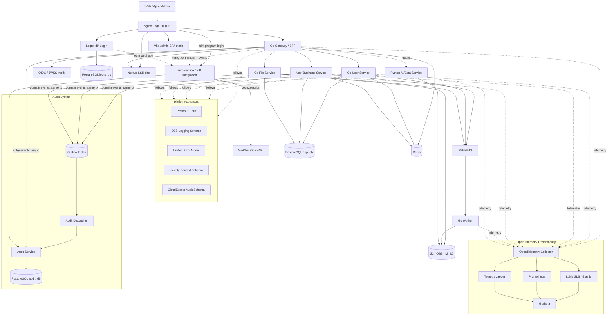

# Ting Boundless Architecture

## One-Sentence Architecture

Nginx guards the edge, Go Gateway/BFF owns shared request logic (identity, routing, BFF cookies) without duplication, Logto owns identity through OIDC/JWKS, Go services own platform capabilities (auth integration, audit, user, file, worker), NestJS + Drizzle owns domain CRUD in TypeScript, Next.js serves SSR web and Vite serves the admin SPA, platform-contracts and generated `node/packages/api-types` keep cross-language behavior and shared TS types consistent, Python is reserved for heavy AI/data pipelines, OpenTelemetry makes the system observable, CloudEvents audit events flow into Audit Service, and PostgreSQL/Redis/RabbitMQ/S3 form the infrastructure base.

## Memory Model

Remember the architecture as:

```text
Edge -> Gateway -> Identity -> Services -> Platform Contracts -> Observability -> Audit -> Data
```

Or in one short phrase:

```text
Edge guarded, identity delegated, gateway centralized, services focused, contracts shared, telemetry standard, audit separated.
```

## Architecture Principles

### 1. Gateway Knows Who, Services Know Permission

The most important rule:

```text
Gateway decides who you are and whether the request may enter.
Business services decide whether you may operate on a specific business resource.
```

The Gateway verifies JWTs, rate limits requests, injects identity context, and routes traffic. Business services still enforce domain authorization such as resource ownership, tenant isolation, and business-state constraints.

Service-to-service calls must also carry identity context. Identity must not disappear after the first hop.

Required context:

```text
request_id
trace_id
actor_user_id
tenant_id
roles
scopes
auth_subject
```

### 2. IdP Is Replaceable, OIDC Is the Contract

Logto is the initial identity provider, but the architecture depends on standards, not on Logto-specific behavior.

Stable identity contracts:

```text
OIDC
OAuth2
JWKS
JWT claims
short-lived access tokens
refresh-token lifecycle managed by IdP
```

If Logto no longer fits later, it can be replaced by Keycloak, Auth0, Clerk, or a self-built OIDC provider without changing the business-service model.

### 3. Business Services Do Not Parse Tokens

Business services should not verify end-user JWTs directly in the normal request path. They receive trusted identity context from the Gateway and enforce business permissions locally.

The Gateway must remove externally supplied identity headers before injecting trusted ones.

External headers to strip:

```text
X-User-Id
X-Tenant-Id
X-Roles
X-Scopes
X-Auth-Subject
X-Request-Id
```

A client-supplied `X-Request-Id` is not trusted: the Gateway generates a fresh `request_id` at the edge. The `X-Request-Id` is only trusted and propagated within the internal service chain (see Service-to-Service Identity), where it carries the correlation id forward.

### 4. Platform Contracts Beat Shared Libraries

The system is designed for Go, Python, Node.js, and Java services. Shared behavior should be defined through platform contracts first, language SDKs second.

Core contracts:

```text
Protobuf + buf for API contracts
ECS-style structured logging fields
OpenTelemetry trace and metrics conventions
CloudEvents audit event schema
Unified error response model
Identity context propagation model
```

API versioning is part of the contract: external APIs are served under a `/v1` path prefix, and buf breaking-change checks guard against incompatible contract changes. Both protect consumers from accidental breakage.

### 5. Observable and Auditable From V1

Observability and auditability are not later-stage polish. They are operational foundations.

Every service must support:

```text
/healthz
/readyz
/metrics
JSON stdout logs
request_id
trace_id
OpenTelemetry propagation
CloudEvents-compatible audit events
```

## Target V1 Architecture



## Component Responsibilities

### Nginx

Nginx is the edge component.

Responsibilities:

```text
HTTPS termination
domain routing
static assets
basic security headers
request body limits
reverse proxy to Gateway and Logto
```

Non-responsibilities:

```text
business authentication
business authorization
user identity parsing
service orchestration
```

### Go Gateway / BFF

The Gateway is the unified business API entry.

Responsibilities:

```text
JWT verification through Logto JWKS/OIDC (with cached JWKS)
rate limiting
request logging
request_id and trace context handling
trusted identity header injection
route forwarding
lightweight API aggregation
unified error response
audit event emission for API entry-level operations
```

The Gateway must clear untrusted identity headers from external traffic before injecting trusted headers.

#### Gateway Resilience to IdP Outages

The Gateway caches Logto JWKS so that a temporary Logto outage does not break verification of already-issued tokens. Only new logins are affected while Logto is unreachable. Gateway readiness must not hard-depend on Logto being reachable.

Audit ownership boundary:

```text
IdP integration emits identity events: user.login.success, user.login.failed, user.logout
Gateway emits entry events: api.access.denied, api.rate_limited, api.token.invalid
Business services emit domain events: resource.delete, payment.refund, ...
```

### Logto

Logto is the initial IdP.

Responsibilities:

```text
phone login
WeChat login
third-party login
password login if needed
OIDC/OAuth2 provider
access-token issuance
refresh-token lifecycle
identity user management
```

Business profile, membership, tenant-specific permissions, and domain user state belong to business services, not Logto.

### Auth Service / IdP Integration

`auth-service` is the integration layer between external identity (Logto, WeChat) and the rest of the system. It is a platform service, not a domain business service.

Responsibilities:

```text
receive and verify Logto webhooks (signature check, normalization, idempotency)
convert identity events into CloudEvents audit events (user.login.*, user.logout)
WeChat mini-program login: code2session exchange, then issue a standard JWT
optionally act as an internal OIDC issuer (its own issuer + published JWKS) when tokens are minted locally
never own domain business logic
```

Any token minted here must be a standard JWT verifiable by the Gateway through a known issuer and JWKS, never an ad-hoc custom token.

### Service Language Split

Public capabilities are implemented once in Go. Domain CRUD and admin-facing business APIs
are implemented in TypeScript (NestJS). Presentation is split between Next.js (SSR) and
Vite (admin SPA). All browser and app traffic still enters through the Go Gateway.

```text
go/ (platform, no duplication):
  go/services/: gateway, auth-service, audit-service, user-service, file-service, worker
  go/pkg/: shared libraries
  go/cmd/, go/migrations/

TypeScript (domain CRUD + web UI) — all under node/ pnpm monorepo:
  node/apps/business-service (NestJS + Drizzle)
  node/apps/site (Next.js)
  node/apps/admin (Vite + React)
  node/packages/api-types (shared types)

Python (heavy AI/data, when needed):
  batch pipelines, training, embeddings at scale
```

### Go Platform Services

Go is the default language for platform and shared infrastructure services.

Initial Go services:

```text
gateway
auth-service
audit-service
user-service
file-service
worker
```

`audit-service` is a platform service, not a domain business service. It is described in
the Audit Baseline section and must not own business domain logic.

Go platform responsibilities:

```text
JWT/session verification and identity header injection (gateway only)
IdP integration and webhooks (auth-service)
audit ingestion (audit-service)
user profile and membership baseline (user-service)
file storage metadata and OSS integration (file-service)
async jobs (worker)
```

Go platform services must not re-implement domain CRUD that belongs in
`business-service`.

### Node Business Service (NestJS + Drizzle)

`node/apps/business-service` (`@ting/business-service`) is the primary domain API for
CRUD, admin workflows, and future productized AI endpoints. It runs as a NestJS HTTP
service behind the Gateway on the internal network.

Stack:

```text
NestJS + TypeScript
Drizzle ORM + PostgreSQL (drizzle-kit migrations)
identity from Gateway-injected headers only (no end-user JWT parsing)
Transactional Outbox for audit-worthy writes
/healthz, /readyz, /metrics, ECS JSON logs, traceparent propagation
```

Responsibilities:

```text
domain logic and CRUD APIs under /v1/business/*
domain authorization (resource ownership, tenant isolation, business-state rules)
business data management in app_db schemas owned by this service
event publishing and audit outbox writes in the same DB transaction
optional AI HTTP endpoints under /v1/business/ai/* (Vercel AI SDK / Mastra later)
```

NestJS is one upstream microservice behind the Gateway, not a second gateway or BFF.
Do not add a separate Node BFF for the admin SPA. Do not use Next.js Route Handlers as
the primary business backend.

### Web Tier

Two frontends share the same Gateway session and `/v1` APIs:

```text
node/apps/site (Next.js, @ting/site):
  SSR and SEO pages
  Server Components fetch Gateway /v1 or read trusted proxy headers
  no next-auth or duplicate OIDC; no end-user JWT in browser JavaScript
  user-specific pages: force-dynamic / noStore (no cached HTML with identity)

node/apps/admin (Vite + React, @ting/admin):
  internal admin SPA (basename /admin when path-routed)
  Ant Design (or equivalent) for tables and forms
  TanStack Query for server state against /v1
  credentials: include for Cookie sessions
  types from @ting/api-types (generated from platform-contracts)
```

Static admin assets can be served by Nginx without a Node runtime. Next.js requires a
Node process and should be reached only through Nginx/Gateway on the internal network.

### Python AI/Data Services

Python is reserved for workloads where its ecosystem is clearly useful.

Use cases:

```text
AI processing
data pipelines
recommendation
embedding generation
document processing
batch analysis
```

Python services must follow the same platform contracts as Go services.

## Authentication Endpoint Protection

Login and SMS/verification-code endpoints are public and high-risk. SMS abuse in particular carries real monetary cost. These endpoints need stricter protection than ordinary APIs.

```text
Nginx: aggressive rate limiting and IP throttling on auth paths
Gateway: per-IP / per-device / per-phone rate limits
CAPTCHA or challenge on suspicious patterns
SMS send quotas and cooldown windows
optional WAF (e.g. Aliyun WAF) in front of auth endpoints
```

## Client Authentication Model

Whether a login request passes through the Gateway depends on the client type. The credential form also differs per client. The Gateway normalizes all of them into the same trusted identity headers, so business services never see client-specific differences.

### Authentication Matrix

```text
Web / Admin (SPA):
  login flow: BFF Token Handler (Gateway performs OIDC code exchange)
  token storage: HttpOnly + Secure cookie (browser never holds the token)
  login through Gateway: yes
  credential to API: cookie

WeChat Mini Program:
  login flow: server-side code2session, then issue a standard JWT (not an ad-hoc token)
  token storage: mini-program storage (HttpOnly cookie not usable)
  login through Gateway: yes (Gateway / auth-service)
  credential to API: Bearer token (header)

Mobile / Native App:
  login flow: standard OIDC + PKCE (AppAuth), directly with Logto
  token storage: OS secure storage (Keychain / Keystore)
  login through Gateway: no (direct to Logto), API calls go through Gateway
  credential to API: Bearer token (header)
```

### Gateway Dual-Credential Normalization

The Gateway must accept both credential forms and normalize them into the same identity context:

```text
Web: read HttpOnly cookie -> validate session
Mini Program / App: read Authorization header -> validate JWT via cached JWKS
both paths -> inject the same trusted identity headers downstream
```

Business services stay credential-agnostic; they only consume the injected identity context.

### Token Issuance Rule (No Ad-Hoc Tokens)

Any token the Gateway accepts must be a standard JWT with a known `issuer` and a published JWKS the Gateway can verify. This applies to the mini-program flow as well: after `code2session`, the token must be issued through a proper issuer, not a custom opaque string.

```text
Option A: issue through Logto / the OIDC system (preferred when Logto supports the flow)
Option B: auth-service acts as an internal OIDC issuer with its own issuer + JWKS
In both cases the Gateway validates via issuer + JWKS, using the same verification path as other clients.
Do not invent per-endpoint custom tokens that the Gateway cannot verify uniformly.
```

### Implementation Implications

```text
Gateway needs a BFF auth module (OIDC client) for the Web cookie flow only
Gateway needs dual-credential handling (cookie + Bearer)
A mini-program login endpoint performs code2session and issues tokens
Mobile uses Logto PKCE directly; the Gateway is not involved in its login
Confirm whether Logto covers WeChat mini-program natively; otherwise implement code2session in auth-service
```

Web / Admin / Next share the same Web credential model in the matrix above: HttpOnly
cookie through the Gateway BFF. Next SSR pages are not a separate auth path.

## End-to-End Request Chain

This section is the canonical V1 wiring for clients, Gateway routing, services, contracts,
and data. V2 adds gRPC on hot internal paths without changing the external `/v1` HTTP
surface.

### Repository Layout

```text
Ting-Boundless/
  platform-contracts/     OpenAPI (external REST) + proto (common types, V2 gRPC)
  node/                   pnpm monorepo — all Node/TypeScript
    apps/
      business-service/   NestJS + Drizzle (@ting/business-service)
      site/               Next.js SSR (@ting/site)
      admin/              Vite + React SPA (@ting/admin)
    packages/
      api-types/          generated TS from OpenAPI (@ting/api-types)
      api-client/         optional orval + TanStack Query (@ting/api-client)
  go/                     Go monorepo (go.mod lives here)
    pkg/                  shared libraries
    services/             gateway, auth, audit, user, file, worker
    cmd/                  migrate, dev-jwt
    migrations/           SQL per Go service
  deploy/                 compose, nginx, otel
```

### Gateway Route Table

| Path | Upstream | Notes |
|------|----------|-------|
| `/sign-in`, `/callback`, `/sign-out` | Go Gateway BFF | Web Cookie session; OIDC via Logto |
| `/`, `/product/*`, public SSR paths | `next-app` (internal) | Next.js behind Gateway/Nginx |
| `/admin`, `/admin/*` | Nginx static / admin build | SPA; `try_files` → `index.html` |
| `/v1/business/*` | `business-service` | NestJS domain CRUD |
| `/v1/users/*` | `user-service` | Go user domain |
| `/v1/files/*` | `file-service` | Go files |
| `/v1/auth/*` | `auth-service` (via Gateway) | Public login/SMS integration; nginx stricter rate limit |
| `/healthz`, `/readyz`, `/metrics` | each service | Liveness/readiness per service |

**Gateway anonymous prefixes** (`GATEWAY_ANON_PREFIXES`): paths that may pass without
end-user credentials (health, BFF `/sign-in*`, `/admin` static, `/v1/business/ping`,
`/v1/auth/*`). All other `/v1/*` requests without a valid cookie or Bearer JWT are
rejected at the Gateway (`401 auth.unauthenticated`), not in business services.

**Internal trust**: Gateway injects `X-Internal-Token` on upstream proxy requests;
business and platform services reject forged identity headers without it (`INTERNAL_API_TOKEN`).

Browsers talk only to Nginx/Gateway. `business-service` listens on the internal network
and must not be exposed directly to the public internet.

### Admin SPA Chain

```text
1. Browser loads /admin static assets from Nginx.
2. Unauthenticated API calls redirect to Gateway /sign-in?return_to=/admin/...
3. Gateway BFF completes OIDC with Logto and sets HttpOnly + Secure cookie.
4. Admin JS calls GET/POST /v1/business/... with credentials: include.
5. Gateway validates cookie/session, strips untrusted headers, injects identity headers.
6. Gateway forwards to Nest business-service.
7. Nest Identity guard reads X-User-Id, X-Tenant-Id, X-Roles, etc.
8. Nest enforces domain authorization, runs Drizzle transaction (business row + outbox).
9. JSON response uses the unified error envelope from platform-contracts.
10. TanStack Query in admin caches and revalidates using @ting/api-types shapes.
```

### Next SSR Chain

```text
1. Browser requests a public or authenticated SSR page (e.g. /product/123).
2. Nginx → Gateway → next-app (internal).
3. Next Server Component fetches Gateway /v1/business/... (server-side) with Cookie
   forwarded, or reads trusted identity headers from the Gateway proxy.
4. Nest/Go services return JSON; Next renders HTML.
5. Client islands (chat, live tables) may use TanStack Query or Vercel AI SDK for UI
   streaming only; business rules remain in Nest/Go APIs.
6. User-specific routes must not be statically cached at the CDN or Next layer.
```

### Mini Program Chain

```text
1. Mini program → Gateway or auth-service login (code2session).
2. auth-service issues a standard JWT (known issuer + JWKS), not an ad-hoc token.
3. Subsequent calls: Authorization: Bearer → Gateway JWKS verify → identity headers.
4. Same /v1/business/* and /v1/users/* as Web; OpenAPI contract is client-agnostic.
```

### Mobile App Chain

```text
1. App authenticates with Logto via OIDC + PKCE (login does not pass through Gateway).
2. App stores tokens in OS secure storage.
3. API calls: Bearer → Gateway → identity headers → Nest/Go services.
```

### Type Sharing Chain

```text
1. Edit platform-contracts OpenAPI for external /v1 REST (business domain first).
2. CI: buf lint/breaking for proto; OpenAPI lint/breaking for REST.
3. Generate @ting/api-types in node/packages/api-types (openapi-typescript or orval).
4. Nest controllers and DTO validation align with api-types.
5. node/apps/admin and node/apps/site import the same @ting/api-types package.
6. Drizzle schema types stay inside node/apps/business-service; map db rows to API DTOs in the service layer.
7. make proto generates Go types for identity, error, audit, and V2 gRPC services.
```

Do not maintain hand-written duplicate interfaces in the frontend and Nest. Do not use
Nest-only or Next-only type tunnels (for example tRPC or Eden Treaty) as the
cross-client contract while mini-program and mobile share the same APIs.

### Internal Communication

V1: HTTP only on the internal network.

```text
Gateway → business-service   HTTP
Gateway → user-service       HTTP
business-service → user-service   HTTP (identity headers forwarded)
```

V2: add gRPC for hot internal paths; external clients remain on HTTP `/v1`.

```text
Gateway → user-service              HTTP or gRPC (Gateway implements REST facade)
business-service → user-service     gRPC + IdentityContext metadata
```

gRPC metadata mirrors HTTP identity headers (see `platform-contracts/proto/ting/common/v1/identity.proto`):

```text
X-Request-Id   → x-request-id
X-User-Id      → x-user-id
X-Tenant-Id    → x-tenant-id
X-Roles        → x-roles
traceparent    → traceparent
```

Business services accept identity on gRPC only from trusted internal callers, with the
same rules as HTTP. Generate Go and TypeScript stubs from the same proto via buf; add TS
plugins to `buf.gen.yaml` when Nest gRPC starts.

### Observability And Audit Chain

```text
Gateway generates request_id and traceparent at the edge.
Gateway emits entry-level audit events asynchronously.
Each service logs ECS JSON to stdout with request_id and service.name.
Domain writes in business-service: PostgreSQL business tables + outbox in one transaction.
Dispatcher/worker → audit-service → audit_db.
```

### Local Development Chain

```text
1. Local PostgreSQL + Redis (or make up-infra).
2. cp .env.example .env
3. make run-gateway
4. make run-user-service (and other Go services as needed)
5. cd node && pnpm dev:business           # Nest :3001
6. cd node && pnpm dev:admin              # Vite, proxy /v1 → Gateway
7. cd node && pnpm dev:site               # Next, API calls via Gateway
8. cd node && pnpm generate:api-types     # after OpenAPI changes
```

### Phased Rollout

| Phase | Goal | Prove |
|-------|------|-------|
| P0 | Gateway real JWT/Cookie BFF; fix middleware order | Login → cookie → identity headers |
| P1 | Nest + Drizzle first resource; OpenAPI + api-types | Admin list/create/update/delete |
| P2 | user-service `/v1/users/me` | Admin shows current user |
| P3 | Next SSR pages (1–2) | Same cookie on public SSR |
| P4 | Outbox + audit minimal loop | Business write produces audit record |
| P5 | compose + nginx route table matches production | Full stack on ECS |
| V2 | buf TS gen; gRPC internal hot paths; full OTel | Nest ↔ user-service latency path |

### Future AI Extension (Same Chain)

Product AI features extend Nest, not Gateway:

```text
Admin/Next UI → Gateway /v1/business/ai/* → Nest AiModule (AI SDK / Mastra)
Tools call Drizzle or internal Go file-service; prompts and tool schemas also land in OpenAPI.
```

## P0 Boundaries To Decide In V1

These are hard to retrofit and must be decided early.

### Multi-Tenant Context

Even if V1 starts single-tenant, the context model must reserve tenant fields.

Required fields:

```text
tenant_id
org_id optional
workspace_id optional
```

Database tables that may become tenant-scoped should reserve `tenant_id` from the start.

### Token Revocation

JWTs must be short-lived. Refresh-token lifecycle is managed by Logto.

V1 policy:

```text
short-lived access tokens
IdP-managed refresh tokens
user/session disable support
Gateway supports revocation lookup for high-risk operations
business services may require fresh authorization for sensitive actions
```

The revocation list and session blocklist are stored in Redis, keyed by subject or session id, so the Gateway can check them with low latency on the hot path.

### Service-to-Service Identity

Internal calls must carry identity and trace context.

Required propagation:

```text
traceparent
baggage optional
X-Request-Id
X-User-Id
X-Tenant-Id
X-Roles
X-Scopes
X-Auth-Subject
```

Async jobs must store the actor context that created the job.

On gRPC (V2), propagate the same fields as gRPC metadata or as `ting.common.v1.IdentityContext`
in RPC messages. Mapping is defined in `identity.proto`.

Propagating identity is not enough; the callee must also be able to trust the caller. Identity headers must only be accepted from the Gateway or from other trusted internal services.

Service-to-service trust model:

```text
V1: network isolation + a shared internal service token (or signed internal header)
V3: mutual TLS between services
business services reject identity headers from untrusted sources, same as external stripping
```

### Secrets

Secret rules:

```text
secrets never enter source code
secrets never enter images
secrets never enter logs
production secrets are injected at deploy time
rotation must be possible
```

V1 can use environment injection. Later stages can use Aliyun KMS, Kubernetes Secrets, External Secrets, or Vault.

### Backups

V1 must include backups from the beginning.

Backup scope:

```text
PostgreSQL app_db
PostgreSQL logto_db
PostgreSQL audit_db
object storage lifecycle rules
deployment configuration
```

Backups are only valid if restore has been tested.

## Health Checks

Use two different health endpoints.

```text
/healthz
  process liveness only
  no external dependency checks

/readyz
  readiness to receive traffic
  checks critical dependencies
```

`/readyz` should check:

```text
PostgreSQL reachable
Redis reachable if used by the service
RabbitMQ reachable if used by the service
required config loaded
object storage reachable for file-service if required
```

The Gateway must not treat Logto JWKS reachability as a hard readiness dependency. Because JWKS is cached, a Logto outage should at most raise a degraded-mode alert, not mark the Gateway as not-ready (which would take the whole system offline).

## Observability Baseline

Use OpenTelemetry as the cross-language observability standard.

V1 requirements:

```text
JSON logs to stdout
ECS-style log fields
traceparent propagation
request_id generation
OpenTelemetry SDK instrumentation
/metrics endpoint
OpenTelemetry Collector lightweight deployment
```

Recommended backends:

```text
logs: Loki, Aliyun SLS, or Elastic
metrics: Prometheus
traces: Tempo or Jaeger
dashboards: Grafana
```

## Audit Baseline

Audit events are not ordinary logs. They represent business-relevant, security-relevant, or compliance-relevant actions.

Use CloudEvents-style schema.

Examples:

```text
user.login.success
user.login.failed
user.phone.bind
user.role.update
resource.delete
payment.refund
admin.operation
```

V1 path:

```text
service -> outbox table (same DB transaction as the business write)
        -> async dispatch -> Audit Service -> PostgreSQL audit_db
```

Even before RabbitMQ is introduced, audit emission must use the Transactional Outbox pattern: the audit event is written to an `outbox` table inside the same transaction as the business change, then dispatched asynchronously. This guarantees "business success implies audit recorded" and prevents either blocking the main flow or silently losing audit records.

Later path:

```text
service -> outbox -> RabbitMQ -> Audit Service -> PostgreSQL audit_db
```

### Audit Sources And Delivery

Audit events come from three sources, and the Transactional Outbox only applies to events tied to a business DB write. The others use lighter delivery.

```text
1. Identity events (user.login.success/failed, user.logout)
   source: Logto webhook -> auth-service; mini-program login from auth-service code2session
   reason: mobile login bypasses the Gateway, so login audit cannot rely on the Gateway
   delivery: auth-service (may use its own outbox) -> Audit Service

2. Entry events (api.access.denied, api.rate_limited, api.token.invalid)
   source: Gateway (no business DB transaction)
   delivery: async emit, directly or via queue (no outbox)

3. Domain events (resource.delete, payment.refund, ...)
   source: business services, tied to a business write
   delivery: Transactional Outbox (same transaction) -> dispatch -> Audit Service
```

The CloudEvents `source` field distinguishes idp / gateway / service origins.

## Data Infrastructure

V1 infrastructure:

```text
PostgreSQL
Redis
RabbitMQ
S3-compatible storage
```

V1 PostgreSQL layout can be one instance with multiple databases or schemas:

```text
logto_db
app_db
audit_db
```

### Deployment Topology (Stateful vs Stateless)

**Do not run databases in the same deployment unit as application services in
production.** Stateful components have a different lifecycle: backups, upgrades,
scaling, and failure modes differ from stateless HTTP workers.

```text
┌─────────────────────────────────────────┐
│  Stateful layer (separate lifecycle)     │
│  PostgreSQL · Redis · RabbitMQ · OSS     │
│  Local dev: deploy/docker-compose.infra  │
│  Production: managed RDS / cloud services│
└─────────────────────────────────────────┘
                    ↑ TCP only (env-driven)
┌─────────────────────────────────────────┐
│  Stateless layer (safe to redeploy)      │
│  gateway · services · nginx · logto      │
│  deploy/docker-compose.yml               │
└─────────────────────────────────────────┘
```

Repository layout:

```text
deploy/docker-compose.infra.yml   Postgres, Redis, RabbitMQ, MinIO (local dev only)
deploy/docker-compose.yml         Application services (all environments)
```

Local development:

```text
docker compose -f deploy/docker-compose.infra.yml -f deploy/docker-compose.yml up -d
# or: make up
```

Production / staging:

```text
managed PostgreSQL / Redis / RabbitMQ / OSS
docker compose -f deploy/docker-compose.yml up -d
# POSTGRES_HOST, REDIS_ADDR, etc. point to managed endpoints in .env
```

Host-native development (preferred for local debugging):

```text
install PostgreSQL / Redis / RabbitMQ on the host
psql -U postgres -f deploy/postgres/setup-local.sql
cp .env.example .env
make run-user-service            # connects to localhost, probes /readyz
```

Optional Docker infra (when native install is not desired):

```text
make up-infra                              # data stores in Docker
POSTGRES_HOST=localhost make run-gateway        # Go services on the host
```

Application services connect via environment variables (`POSTGRES_HOST`,
`POSTGRES_PORT`, `REDIS_ADDR`, `RABBITMQ_URL`, `S3_ENDPOINT`). They must not
assume co-location with data stores.

Shared connection helpers:

```text
go/pkg/db       PostgreSQL (pgx pool, /readyz probe)
go/pkg/cache    Redis
go/pkg/mq       RabbitMQ
go/pkg/storage  S3-compatible endpoint (TCP probe)
go/pkg/config   LoadEnvFile(), IsPlaceholder() for cloud stubs
```

Local dev defaults target `localhost`. Production uses managed endpoints; until
real cloud values are configured, placeholder hosts (e.g. `rm-xxx`,
`*-placeholder`) skip connection and fail `/readyz` with "not configured".

Later stages can move fully to managed RDS, managed Redis, RabbitMQ cluster, and
managed object storage without changing service code.

### Schema Migrations

Database schema changes are managed with a migration tool (golang-migrate or Atlas). Migration scripts are versioned in Git and applied through CI, never by hand on the server. Each service owns and migrates its own schema/database.

## Minimal CI/CD For V1

Do not wait until platform phase for CI.

V1 pipeline:

```text
lint
test
build
container image build
image scan
push image to ACR
version docker-compose deployment artifacts
```

Deployment can remain manual at first, but build and image publishing should be automated early.

## Evolution Roadmap

### V1: Low-Cost, Correct Boundaries

```text
single ECS
Docker Compose (apps separate from data infra)
Nginx
Go Gateway/BFF
Logto
auth-service (IdP integration)
Go platform services (user, file, audit, worker)
NestJS business-service + Drizzle
node/apps/site (Next.js) + node/apps/admin (Vite)
node/packages/api-types generated from platform-contracts OpenAPI
PostgreSQL (managed or local infra compose for dev)
Redis
RabbitMQ
S3/OSS
Audit Service
OpenTelemetry baseline
platform-contracts (OpenAPI + proto)
Go service template + Nest business-service template
minimal CI and backups
```

### V2: Multi-Service Maturity

```text
gRPC + Protobuf for hot internal APIs (Gateway or Nest ↔ Go); external /v1 stays HTTP
buf lint, breaking-change checks, and TypeScript generation plugins in buf.gen.yaml
full OpenTelemetry pipeline (including gRPC interceptors)
Prometheus/Grafana/Loki/Tempo
async audit via RabbitMQ
Python AI/Data service for heavy offline/ML pipelines
Nest AI modules (AI SDK / Mastra) for product-facing AI HTTP APIs
stronger service templates for Python and Nest
```

### V3: Platform Stage

```text
Kubernetes / ACK
managed PostgreSQL / Redis
Service Mesh or Dapr if needed
mTLS
progressive delivery
Backstage or internal developer portal
multi-environment governance
policy-as-code
```

## Final Decision

The architecture is designed to avoid premature platform complexity while still preserving long-term correctness.

The V1 decision is:

```text
Nginx at the edge.
Logto for identity.
Go Gateway/BFF for all shared request logic (no duplicate auth in Nest or Next).
Go for platform services (gateway, auth, audit, user, file, worker).
NestJS + Drizzle for domain CRUD in business-service.
Next.js for SSR web; Vite + React for admin SPA; TanStack Query + @ting/api-types in node/ monorepo.
Python only for heavy AI/data pipelines when clearly needed.
platform-contracts (OpenAPI + proto) for cross-language consistency and shared TS types.
HTTP /v1 for all external and V1 internal traffic; gRPC in V2 for hot internal paths.
OpenTelemetry for observability.
CloudEvents + Audit Service + Transactional Outbox for auditability.
PostgreSQL/Redis/RabbitMQ/S3 as the infrastructure base.
Docker Compose for stateless apps; data stores managed or in deploy/docker-compose.infra.yml for local dev.
Single ECS first, K8s later.
```

