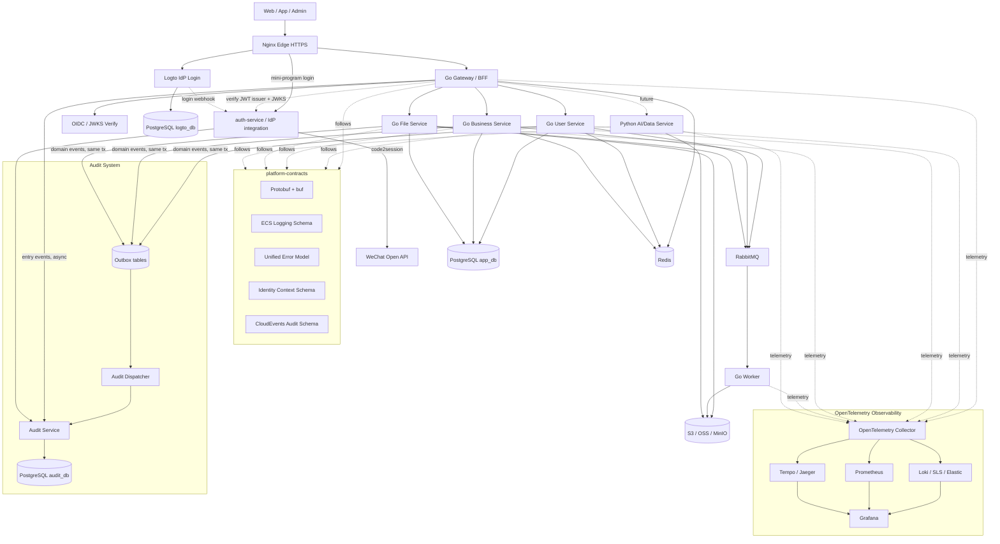

# Ting Boundless Architecture

## One-Sentence Architecture

Nginx guards the edge, Go Gateway/BFF owns shared request logic, Logto owns identity, Go services own core business, Python is reserved for AI/data workloads, platform-contracts keep cross-language behavior consistent, OpenTelemetry makes the system observable, CloudEvents audit events flow into Audit Service, and PostgreSQL/Redis/RabbitMQ/S3 form the infrastructure base.

## Memory Model

Remember the architecture as:

```text
Edge -> Gateway -> Identity -> Services -> Platform Contracts -> Observability -> Audit -> Data
```

Or in one short phrase:

```text
Edge guarded, identity delegated, gateway centralized, services focused, contracts shared, telemetry standard, audit separated.
```

## Architecture Principles

### 1. Gateway Knows Who, Services Know Permission

The most important rule:

```text
Gateway decides who you are and whether the request may enter.
Business services decide whether you may operate on a specific business resource.
```

The Gateway verifies JWTs, rate limits requests, injects identity context, and routes traffic. Business services still enforce domain authorization such as resource ownership, tenant isolation, and business-state constraints.

Service-to-service calls must also carry identity context. Identity must not disappear after the first hop.

Required context:

```text
request_id
trace_id
actor_user_id
tenant_id
roles
scopes
auth_subject
```

### 2. IdP Is Replaceable, OIDC Is the Contract

Logto is the initial identity provider, but the architecture depends on standards, not on Logto-specific behavior.

Stable identity contracts:

```text
OIDC
OAuth2
JWKS
JWT claims
short-lived access tokens
refresh-token lifecycle managed by IdP
```

If Logto no longer fits later, it can be replaced by Keycloak, Auth0, Clerk, or a self-built OIDC provider without changing the business-service model.

### 3. Business Services Do Not Parse Tokens

Business services should not verify end-user JWTs directly in the normal request path. They receive trusted identity context from the Gateway and enforce business permissions locally.

The Gateway must remove externally supplied identity headers before injecting trusted ones.

External headers to strip:

```text
X-User-Id
X-Tenant-Id
X-Roles
X-Scopes
X-Auth-Subject
X-Request-Id
```

A client-supplied `X-Request-Id` is not trusted: the Gateway generates a fresh `request_id` at the edge. The `X-Request-Id` is only trusted and propagated within the internal service chain (see Service-to-Service Identity), where it carries the correlation id forward.

### 4. Platform Contracts Beat Shared Libraries

The system is designed for Go, Python, Node.js, and Java services. Shared behavior should be defined through platform contracts first, language SDKs second.

Core contracts:

```text
Protobuf + buf for API contracts
ECS-style structured logging fields
OpenTelemetry trace and metrics conventions
CloudEvents audit event schema
Unified error response model
Identity context propagation model
```

API versioning is part of the contract: external APIs are served under a `/v1` path prefix, and buf breaking-change checks guard against incompatible contract changes. Both protect consumers from accidental breakage.

### 5. Observable and Auditable From V1

Observability and auditability are not later-stage polish. They are operational foundations.

Every service must support:

```text
/healthz
/readyz
/metrics
JSON stdout logs
request_id
trace_id
OpenTelemetry propagation
CloudEvents-compatible audit events
```

## Target V1 Architecture



## Component Responsibilities

### Nginx

Nginx is the edge component.

Responsibilities:

```text
HTTPS termination
domain routing
static assets
basic security headers
request body limits
reverse proxy to Gateway and Logto
```

Non-responsibilities:

```text
business authentication
business authorization
user identity parsing
service orchestration
```

### Go Gateway / BFF

The Gateway is the unified business API entry.

Responsibilities:

```text
JWT verification through Logto JWKS/OIDC (with cached JWKS)
rate limiting
request logging
request_id and trace context handling
trusted identity header injection
route forwarding
lightweight API aggregation
unified error response
audit event emission for API entry-level operations
```

The Gateway must clear untrusted identity headers from external traffic before injecting trusted headers.

#### Gateway Resilience to IdP Outages

The Gateway caches Logto JWKS so that a temporary Logto outage does not break verification of already-issued tokens. Only new logins are affected while Logto is unreachable. Gateway readiness must not hard-depend on Logto being reachable.

Audit ownership boundary:

```text
IdP integration emits identity events: user.login.success, user.login.failed, user.logout
Gateway emits entry events: api.access.denied, api.rate_limited, api.token.invalid
Business services emit domain events: resource.delete, payment.refund, ...
```

### Logto

Logto is the initial IdP.

Responsibilities:

```text
phone login
WeChat login
third-party login
password login if needed
OIDC/OAuth2 provider
access-token issuance
refresh-token lifecycle
identity user management
```

Business profile, membership, tenant-specific permissions, and domain user state belong to business services, not Logto.

### Auth Service / IdP Integration

`auth-service` is the integration layer between external identity (Logto, WeChat) and the rest of the system. It is a platform service, not a domain business service.

Responsibilities:

```text
receive and verify Logto webhooks (signature check, normalization, idempotency)
convert identity events into CloudEvents audit events (user.login.*, user.logout)
WeChat mini-program login: code2session exchange, then issue a standard JWT
optionally act as an internal OIDC issuer (its own issuer + published JWKS) when tokens are minted locally
never own domain business logic
```

Any token minted here must be a standard JWT verifiable by the Gateway through a known issuer and JWKS, never an ad-hoc custom token.

### Go Business Services

Go is the default language for core services.

Initial services:

```text
user-service
business-service
file-service
worker
```

`audit-service` is a platform service, not a domain business service. It is described in the Audit Baseline section and must not own business domain logic.

Responsibilities:

```text
domain logic
domain authorization
resource ownership checks
tenant isolation
business data management
event publishing
audit event publishing
```

### Python AI/Data Services

Python is reserved for workloads where its ecosystem is clearly useful.

Use cases:

```text
AI processing
data pipelines
recommendation
embedding generation
document processing
batch analysis
```

Python services must follow the same platform contracts as Go services.

## Authentication Endpoint Protection

Login and SMS/verification-code endpoints are public and high-risk. SMS abuse in particular carries real monetary cost. These endpoints need stricter protection than ordinary APIs.

```text
Nginx: aggressive rate limiting and IP throttling on auth paths
Gateway: per-IP / per-device / per-phone rate limits
CAPTCHA or challenge on suspicious patterns
SMS send quotas and cooldown windows
optional WAF (e.g. Aliyun WAF) in front of auth endpoints
```

## Client Authentication Model

Whether a login request passes through the Gateway depends on the client type. The credential form also differs per client. The Gateway normalizes all of them into the same trusted identity headers, so business services never see client-specific differences.

### Authentication Matrix

```text
Web / Admin (SPA):
  login flow: BFF Token Handler (Gateway performs OIDC code exchange)
  token storage: HttpOnly + Secure cookie (browser never holds the token)
  login through Gateway: yes
  credential to API: cookie

WeChat Mini Program:
  login flow: server-side code2session, then issue a standard JWT (not an ad-hoc token)
  token storage: mini-program storage (HttpOnly cookie not usable)
  login through Gateway: yes (Gateway / auth-service)
  credential to API: Bearer token (header)

Mobile / Native App:
  login flow: standard OIDC + PKCE (AppAuth), directly with Logto
  token storage: OS secure storage (Keychain / Keystore)
  login through Gateway: no (direct to Logto), API calls go through Gateway
  credential to API: Bearer token (header)
```

### Gateway Dual-Credential Normalization

The Gateway must accept both credential forms and normalize them into the same identity context:

```text
Web: read HttpOnly cookie -> validate session
Mini Program / App: read Authorization header -> validate JWT via cached JWKS
both paths -> inject the same trusted identity headers downstream
```

Business services stay credential-agnostic; they only consume the injected identity context.

### Token Issuance Rule (No Ad-Hoc Tokens)

Any token the Gateway accepts must be a standard JWT with a known `issuer` and a published JWKS the Gateway can verify. This applies to the mini-program flow as well: after `code2session`, the token must be issued through a proper issuer, not a custom opaque string.

```text
Option A: issue through Logto / the OIDC system (preferred when Logto supports the flow)
Option B: auth-service acts as an internal OIDC issuer with its own issuer + JWKS
In both cases the Gateway validates via issuer + JWKS, using the same verification path as other clients.
Do not invent per-endpoint custom tokens that the Gateway cannot verify uniformly.
```

### Implementation Implications

```text
Gateway needs a BFF auth module (OIDC client) for the Web cookie flow only
Gateway needs dual-credential handling (cookie + Bearer)
A mini-program login endpoint performs code2session and issues tokens
Mobile uses Logto PKCE directly; the Gateway is not involved in its login
Confirm whether Logto covers WeChat mini-program natively; otherwise implement code2session in auth-service
```

## P0 Boundaries To Decide In V1

These are hard to retrofit and must be decided early.

### Multi-Tenant Context

Even if V1 starts single-tenant, the context model must reserve tenant fields.

Required fields:

```text
tenant_id
org_id optional
workspace_id optional
```

Database tables that may become tenant-scoped should reserve `tenant_id` from the start.

### Token Revocation

JWTs must be short-lived. Refresh-token lifecycle is managed by Logto.

V1 policy:

```text
short-lived access tokens
IdP-managed refresh tokens
user/session disable support
Gateway supports revocation lookup for high-risk operations
business services may require fresh authorization for sensitive actions
```

The revocation list and session blocklist are stored in Redis, keyed by subject or session id, so the Gateway can check them with low latency on the hot path.

### Service-to-Service Identity

Internal calls must carry identity and trace context.

Required propagation:

```text
traceparent
baggage optional
X-Request-Id
X-User-Id
X-Tenant-Id
X-Roles
X-Scopes
X-Auth-Subject
```

Async jobs must store the actor context that created the job.

Propagating identity is not enough; the callee must also be able to trust the caller. Identity headers must only be accepted from the Gateway or from other trusted internal services.

Service-to-service trust model:

```text
V1: network isolation + a shared internal service token (or signed internal header)
V3: mutual TLS between services
business services reject identity headers from untrusted sources, same as external stripping
```

### Secrets

Secret rules:

```text
secrets never enter source code
secrets never enter images
secrets never enter logs
production secrets are injected at deploy time
rotation must be possible
```

V1 can use environment injection. Later stages can use Aliyun KMS, Kubernetes Secrets, External Secrets, or Vault.

### Backups

V1 must include backups from the beginning.

Backup scope:

```text
PostgreSQL app_db
PostgreSQL logto_db
PostgreSQL audit_db
object storage lifecycle rules
deployment configuration
```

Backups are only valid if restore has been tested.

## Health Checks

Use two different health endpoints.

```text
/healthz
  process liveness only
  no external dependency checks

/readyz
  readiness to receive traffic
  checks critical dependencies
```

`/readyz` should check:

```text
PostgreSQL reachable
Redis reachable if used by the service
RabbitMQ reachable if used by the service
required config loaded
object storage reachable for file-service if required
```

The Gateway must not treat Logto JWKS reachability as a hard readiness dependency. Because JWKS is cached, a Logto outage should at most raise a degraded-mode alert, not mark the Gateway as not-ready (which would take the whole system offline).

## Observability Baseline

Use OpenTelemetry as the cross-language observability standard.

V1 requirements:

```text
JSON logs to stdout
ECS-style log fields
traceparent propagation
request_id generation
OpenTelemetry SDK instrumentation
/metrics endpoint
OpenTelemetry Collector lightweight deployment
```

Recommended backends:

```text
logs: Loki, Aliyun SLS, or Elastic
metrics: Prometheus
traces: Tempo or Jaeger
dashboards: Grafana
```

## Audit Baseline

Audit events are not ordinary logs. They represent business-relevant, security-relevant, or compliance-relevant actions.

Use CloudEvents-style schema.

Examples:

```text
user.login.success
user.login.failed
user.phone.bind
user.role.update
resource.delete
payment.refund
admin.operation
```

V1 path:

```text
service -> outbox table (same DB transaction as the business write)
        -> async dispatch -> Audit Service -> PostgreSQL audit_db
```

Even before RabbitMQ is introduced, audit emission must use the Transactional Outbox pattern: the audit event is written to an `outbox` table inside the same transaction as the business change, then dispatched asynchronously. This guarantees "business success implies audit recorded" and prevents either blocking the main flow or silently losing audit records.

Later path:

```text
service -> outbox -> RabbitMQ -> Audit Service -> PostgreSQL audit_db
```

### Audit Sources And Delivery

Audit events come from three sources, and the Transactional Outbox only applies to events tied to a business DB write. The others use lighter delivery.

```text
1. Identity events (user.login.success/failed, user.logout)
   source: Logto webhook -> auth-service; mini-program login from auth-service code2session
   reason: mobile login bypasses the Gateway, so login audit cannot rely on the Gateway
   delivery: auth-service (may use its own outbox) -> Audit Service

2. Entry events (api.access.denied, api.rate_limited, api.token.invalid)
   source: Gateway (no business DB transaction)
   delivery: async emit, directly or via queue (no outbox)

3. Domain events (resource.delete, payment.refund, ...)
   source: business services, tied to a business write
   delivery: Transactional Outbox (same transaction) -> dispatch -> Audit Service
```

The CloudEvents `source` field distinguishes idp / gateway / service origins.

## Data Infrastructure

V1 infrastructure:

```text
PostgreSQL
Redis
RabbitMQ
S3-compatible storage
```

V1 deployment can use one PostgreSQL instance with multiple databases or schemas:

```text
logto_db
app_db
audit_db
```

Later stages can move to managed RDS, managed Redis, RabbitMQ cluster, and managed object storage.

### Schema Migrations

Database schema changes are managed with a migration tool (golang-migrate or Atlas). Migration scripts are versioned in Git and applied through CI, never by hand on the server. Each service owns and migrates its own schema/database.

## Minimal CI/CD For V1

Do not wait until platform phase for CI.

V1 pipeline:

```text
lint
test
build
container image build
image scan
push image to ACR
version docker-compose deployment artifacts
```

Deployment can remain manual at first, but build and image publishing should be automated early.

## Evolution Roadmap

### V1: Low-Cost, Correct Boundaries

```text
single ECS
Docker Compose
Nginx
Go Gateway/BFF
Logto
auth-service (IdP integration)
Go core services
PostgreSQL
Redis
RabbitMQ
S3/OSS
Audit Service
OpenTelemetry baseline
platform-contracts
Go service template
minimal CI and backups
```

### V2: Multi-Service Maturity

```text
gRPC + Protobuf for hot internal APIs
buf lint and breaking-change checks
full OpenTelemetry pipeline
Prometheus/Grafana/Loki/Tempo
async audit via RabbitMQ
Python AI/Data service
stronger service templates for Python/Node/Java
```

### V3: Platform Stage

```text
Kubernetes / ACK
managed PostgreSQL / Redis
Service Mesh or Dapr if needed
mTLS
progressive delivery
Backstage or internal developer portal
multi-environment governance
policy-as-code
```

## Final Decision

The architecture is designed to avoid premature platform complexity while still preserving long-term correctness.

The V1 decision is:

```text
Nginx at the edge.
Logto for identity.
Go Gateway/BFF for shared request logic.
Go for core business services.
Python only where AI/data value is clear.
platform-contracts for cross-language consistency.
OpenTelemetry for observability.
CloudEvents + Audit Service for auditability.
PostgreSQL/Redis/RabbitMQ/S3 as the infrastructure base.
Docker Compose on one ECS first, K8s later.
```

