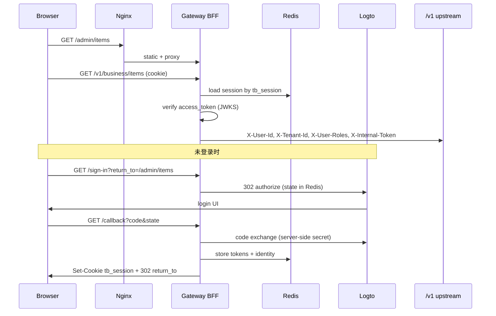

# Web BFF + Logto（生产路径与联调）

Gateway 已实现完整的 OIDC BFF（`/sign-in` → Logto → `/callback` → HttpOnly cookie）。
**前端与业务服务只需调用既有 HTTP 接口**，不要在 Admin / Nest / Next 中重复实现 OIDC 或解析 JWT。

相关实现：`go/services/gateway/internal/bff/`、`go/pkg/oidc/`。

本地 Logto 安装见 [LOGTO_SETUP.md](./LOGTO_SETUP.md)。本文侧重 **生产拓扑、调用契约、联调步骤**。

---

## 架构（谁做什么）



| 层 | 职责 | 不做 |
|----|------|------|
| **Browser / `@ting/admin`** | 跳转 `/sign-in`；`fetch` 带 `credentials: 'include'` | 不存 access_token；不解析 JWT |
| **Gateway BFF** | OIDC code flow、Redis session、JWKS 校验、注入 identity headers | 不做领域授权 |
| **Logto** | 用户目录、登录 UI、签发 API access token | 不直连业务服务 |
| **Nest / Go 业务服务** | 读 `X-User-*` headers（仅内网 + internal token） | 不解析 end-user JWT |

---

## Gateway BFF HTTP 契约（客户端唯一入口）

所有路径在 **Gateway 公网 origin** 上（生产：`https://api.example.com`；本地：`http://127.0.0.1:8080`）。

| 方法 | 路径 | 匿名 | 说明 |
|------|------|------|------|
| `GET` | `/sign-in` | ✅ | 开始登录。Query：`return_to`（站内相对路径，默认 `/`） |
| `GET` | `/callback` | ✅ | Logto 回调；由 Gateway 处理，浏览器勿直接调用 |
| `GET` | `/sign-out` | ✅ | 清除 session。Query：`return_to`（可选） |
| `GET` | `/sign-in/dev` | 仅 `GATEWAY_BFF_DEV_LOGIN=true` | 开发用，生产必须关闭 |

### 登录（Admin SPA）

未登录时跳转到 Gateway（**不是** Logto 域名）：

```text
GET {GATEWAY_ORIGIN}/sign-in?return_to=/admin/items
```

成功后在浏览器设置 HttpOnly cookie（默认名 `tb_session`），再 302 到 `return_to`。

### 登出

```text
GET {GATEWAY_ORIGIN}/sign-out?return_to=/admin/items
```

### 已登录 API 调用

```text
GET {GATEWAY_ORIGIN}/v1/business/items
Cookie: tb_session=...
```

`@ting/api` 的 `apiFetch` 默认 `credentials: 'include'`，无需手动带 `Authorization`。

---

## `@ting/admin` 集成（已实现，仅改配置）

| 环境 | 文件 | 关键变量 |
|------|------|----------|
| Vite 开发 | `node/apps/admin/.env.development` | `VITE_DEV_LOGIN=true` → `/sign-in/dev` |
| 生产构建 | `node/apps/admin/.env.production` | `VITE_DEV_LOGIN=false`，`VITE_SIGN_IN_PATH=/sign-in` |

`src/config/auth.ts` 在 401 时调用 `redirectToSignIn()` → 上述 sign-in 路径。

**生产部署：**

1. `pnpm --filter @ting/admin build` → 静态资源由 nginx `location /admin/` 或 Gateway 托管
2. 用户访问 `https://api.example.com/admin/items`（与 Gateway **同源**，cookie 才能带上）
3. 勿把 Admin 部署到与 API 不同的站点根域而未配置 cookie 域策略

Vite 开发时 proxy 已转发 `/v1`、`/sign-in`、`/callback`、`/sign-out` 到 Gateway（见 `vite.config.ts`）。

---

## 生产环境变量

Gateway（`.env` 或 compose）：

```env
APP_ENV=production
GATEWAY_PUBLIC_URL=https://api.example.com
OIDC_REDIRECT_URI=https://api.example.com/callback
GATEWAY_BFF_DEV_LOGIN=false

OIDC_ISSUER=https://<logto-host>/oidc
OIDC_JWKS_URL=https://<logto-host>/oidc/jwks
OIDC_AUDIENCE=https://api.example.com          # Logto API resource identifier（绝对 URI）
OIDC_RESOURCE=https://api.example.com          # 与 AUDIENCE 相同（Logto RFC 8707）
OIDC_CLIENT_ID=<Traditional Web App App ID>
OIDC_CLIENT_SECRET=<App secret>
# OIDC_SCOPES=openid profile email             # 默认即可

REDIS_ADDR=<managed-redis>:6379
AUTH_SERVICE_URL=http://auth-service:8084      # Logto sub → platform user_id
INTERNAL_API_TOKEN=<strong-random>
# SESSION_COOKIE_SECURE=true   # optional; defaults true when APP_ENV=production
```

`OIDC_REDIRECT_URI` 未设置时由 `GATEWAY_PUBLIC_URL + /callback` 推导（见 `go/pkg/oidc/client.go`）。

生产 HTTPS 下 session cookie 自动带 `Secure`（`APP_ENV=production` 或显式 `SESSION_COOKIE_SECURE=true`）。

Compose 生产片段见 `deploy/docker-compose.prod.yml`、`docs/DEPLOY_TENCENT.md`。

---

## Logto 控制台配置

### 1. API Resource

- **Identifier**：与 `OIDC_AUDIENCE` / `OIDC_RESOURCE` 完全一致（HTTPS 生产域名或约定的绝对 URI）
- 本地示例：`https://api.ting-boundless.local`（见 [LOGTO_SETUP.md](./LOGTO_SETUP.md)）

### 2. Traditional Web App（Gateway BFF）

| 字段 | 值 |
|------|-----|
| 类型 | Traditional Web App |
| Redirect URIs | `https://api.example.com/callback`（与 `OIDC_REDIRECT_URI` 逐字符一致） |
| App ID / Secret | → `OIDC_CLIENT_ID` / `OIDC_CLIENT_SECRET` |

自动化（仅本地）：`scripts/configure-logto-local.ps1 -UpdateEnv`

### 3. 角色与审计页（`admin`）

`GET /v1/audit/events` 要求 access token 的 **`roles` 声明** 含 `admin`（Gateway 映射为 `X-User-Roles`）。

Logto 默认 access token 可能不含 `roles`。在 Logto Console → **JWT customizer**（API access token）添加自定义声明，例如：

```javascript
const getCustomJwtClaims = async ({ token, context }) => {
  const roles = context.user?.roles?.map((r) => r.name) ?? ['user'];
  return {
    roles,
    tenant_id: context.user?.customData?.tenant_id ?? 'default',
  };
};
```

然后在 Logto 为用户分配 `admin` 角色（或你的 RBAC 模型中等价角色名必须为 `admin`）。

开发环境可用 `/sign-in/dev?roles=user,admin` 绕过 Logto（**生产禁止**）。

### 4. Webhook（可选，身份审计）

见 [LOGTO_SETUP.md § Webhooks](./LOGTO_SETUP.md#webhooks-identity-audit)。  
`PostSignIn` 会在 auth-service 侧建立 `logto` → `user_id` 映射；Gateway 首次请求也会懒创建（`auth-service` `/internal/identity/resolve`）。

---

## 联调步骤

### A. 本地 + Logto（推荐先跑通再上生产）

前置：[LOGTO_SETUP.md](./LOGTO_SETUP.md) 完成 Logto、`OIDC_CLIENT_*`、`GATEWAY_BFF_DEV_LOGIN=false`。

```bash
make migrate
make run-gateway
make run-business
make run-audit    # 审计页需要
make run-auth     # Logto sub → user_id
```

**方式 1 — 经 Gateway 托管 Admin（生产同构）**

```bash
cd node && pnpm --filter @ting/admin build
# Gateway 或 nginx 提供 /admin/*
```

1. 打开 `http://127.0.0.1:8080/sign-in?return_to=/admin/items`
2. Logto 登录 → 回到 `/admin/items`
3. 验证 API：

```bash
# 浏览器登录后，从 DevTools → Application → Cookies 复制 tb_session，或：
curl -c cookies.txt -L "http://127.0.0.1:8080/sign-in?return_to=/"
# 在浏览器完成 Logto 登录后，用同一 cookie jar：
curl -b cookies.txt http://127.0.0.1:8080/v1/business/me
curl -b cookies.txt http://127.0.0.1:8080/v1/audit/events?limit=5
```

**方式 2 — Vite 开发服务器**

`node/apps/admin/.env.development` 改为 Logto 模式：

```env
VITE_DEV_LOGIN=false
VITE_SIGN_IN_PATH=/sign-in
```

```bash
make run-admin   # :5173，proxy 到 Gateway
```

打开 `http://localhost:5173/admin/items` → 未登录会跳 `/sign-in`（经 proxy 到 Gateway）。

### B. 生产冒烟清单

| # | 检查 |
|---|------|
| 1 | `GATEWAY_BFF_DEV_LOGIN=false` |
| 2 | Logto Redirect URI = `OIDC_REDIRECT_URI`（https） |
| 3 | Gateway 日志：`oidc bff enabled`（非 `oidc bff disabled`） |
| 4 | `GET https://api.example.com/sign-in` → 302 到 Logto |
| 5 | 登录后 `GET /v1/business/me` 返回 `user_id`（非 401） |
| 6 | 运维账号含 `admin` role → `GET /v1/audit/events` 200 |
| 7 | `GET /sign-out` 后 `/v1/business/me` → 401 |

自动化 dev cookie 冒烟：`make e2e-admin`（**不**覆盖 Logto；见 [E2E_ADMIN.md](./E2E_ADMIN.md)）。

---

## Nginx / 路由

`deploy/nginx/nginx.conf`：

- `/admin/` → 静态 SPA
- `/`、`/v1/*`、`/sign-in`、`/callback`、`/sign-out` → **Gateway**（BFF 与 API 同入口）
- `/oidc/`、`/logto/` → Logto（可选；也可让浏览器直连 Logto Cloud）

生产务必 HTTPS，使浏览器在跨站策略下正常携带 `SameSite=Lax` session cookie。

---

## 故障排查

| 现象 | 原因 / 处理 |
|------|-------------|
| `/sign-in` → `oidc_not_configured` | 设置 `OIDC_CLIENT_ID` + `OIDC_CLIENT_SECRET` |
| `/sign-in` → `session_unavailable` | 启动 Redis，`REDIS_ADDR` 正确 |
| `token_exchange_failed` | Redirect URI 与 Logto 应用不一致；检查 `OIDC_REDIRECT_URI` |
| `audience mismatch` | Logto API identifier ≠ `OIDC_AUDIENCE` |
| `invalid_target: resource indicator...` | `OIDC_RESOURCE` 必须为绝对 URI |
| 登录成功但 `/v1/*` 401 | Cookie 未带上：检查同源、HTTPS、`credentials: 'include'` |
| `/v1/audit/events` 403 | access token 缺 `roles: ["admin"]`；配置 Logto JWT customizer |
| `user_id` 为空 / resolve 警告 | 启动 auth-service；检查 `AUTH_SERVICE_URL`、`INTERNAL_API_TOKEN` |
| 开发误用 `/sign-in/dev` | 生产确认 `GATEWAY_BFF_DEV_LOGIN=false` |

---

## 参考

- [LOGTO_SETUP.md](./LOGTO_SETUP.md) — 本地 Logto 安装与 webhook
- [E2E_ADMIN.md](./E2E_ADMIN.md) — dev cookie 自动化冒烟
- [MOBILE_AUTH.md](./MOBILE_AUTH.md) — 移动端 Bearer（**不走** BFF cookie）
- [DEPLOY_TENCENT.md](./DEPLOY_TENCENT.md) — 生产 `.env` 与 HTTPS
- `go/services/gateway/README.md` — Gateway 环境变量与匿名路径
